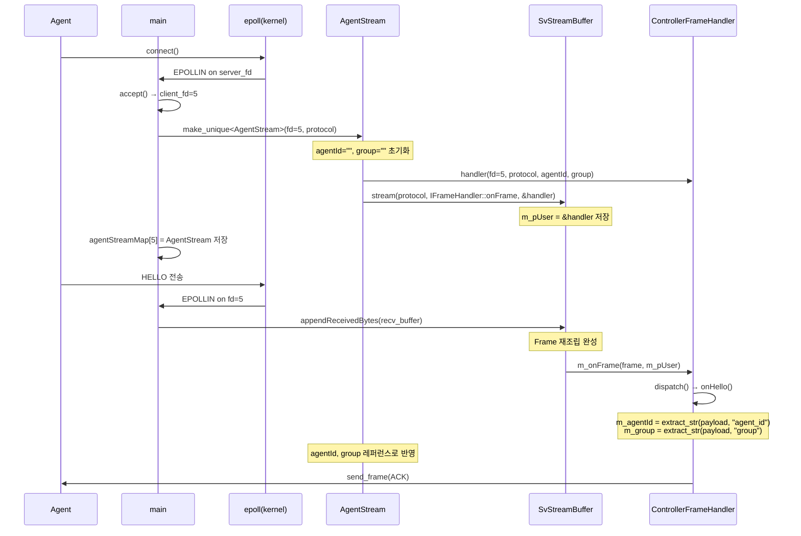

# DESIGN — 아키텍처 및 설계

## 1. 시스템 구성

```
[agent-1]──┐
[agent-2]──┼──TCP 9090 (sv_network)──► [controller]
[agent-N]──┘
```


| 컴포넌트 | 역할 |
|---------|------|
| controller | epoll 서버. Agent 연결 수락·관리, 정책 판단, 명령 브로드캐스트 |
| agent | 논블로킹 connect. HEARTBEAT/STATE 주기 송신 + CMD 수신 |
| libs (`src/libs`) | sv_core (MemoryPool, TcpProtocol 등), sv_logger — 양측 공유 |

---

## 2. 메시지 타입

| Type | 방향 | 주기 | 설명 |
|------|------|------|------|
| HELLO | Agent→Controller | 1회 | 기동 시 등록 |
| HEARTBEAT | Agent→Controller | 1s | 생존 신호 |
| STATE | Agent→Controller | 3s | CPU·온도·모드 메트릭 |
| ACK | 양방향 | 응답 | 동일 seq로 확인 응답 |
| NACK | 양방향 | 응답 | 거부/오류 응답 |
| CMD_START / CMD_STOP / CMD_SET_MODE | Controller→Agent | 명령 시 | 장치 제어 |
| ERROR | 양방향 | 이상 시 | 오류 알림 |

---

## 3. Wire Protocol

**Frame 구조**
```
[Magic 'S''V'][Version 1B][Type 1B][Seq 4B][Length 4B][Payload...][CRC32 4B]
```

| 필드 | 크기 | 설명 |
|------|------|------|
| Magic | 2B | `0x53 0x56` — 시스템 식별자 |
| Version | 1B | 프로토콜 버전 |
| Type | 1B | 메시지 타입 enum |
| Seq | 4B | ACK 매칭용 시퀀스 번호 |
| Length | 4B | Payload 길이 |
| Payload | N B | JSON 직렬화 데이터 |
| CRC32 | 4B | Payload 무결성 검증 |

**payload 소유권:** `decode()` 에서 raw 버퍼 → `Frame::payload(vector)` 1회 복사, 이후 전 구간 `std::move`.

---

## 4. Framing 시퀀스

TCP는 바이트 스트림이다. "어디서 어디까지가 하나의 메시지인지" TCP 자체는 보장하지 않는다.

```
보낸 것:  [HELLO 100B][HEARTBEAT 50B]
받는 쪽:  [70B] → [80B]   ← TCP가 임의로 분할해서 도착
```

이를 해결하기 위해 송수신 양단에 프레이밍 계층을 직접 구현한다.

**송신 경로**
```
application
  └─ send_frame(fd, type, seq, payload)
       └─ TcpProtocol::encode(Frame)   → [Magic][Ver][Type][Seq][Len][Payload][CRC32]
       └─ send(fd, bytes)              → TCP 소켓으로 전송
```

**수신 경로**
```
TCP 소켓
  └─ recv(fd, buf)
       └─ SvStreamBuffer::appendReceivedBytes()   조각을 내부 버퍼에 누적
            Header의 Length 필드를 보고 완성 판단
            완성되면 TcpProtocol::decode() 호출
       └─ TcpProtocol::decode(bytes)   → Frame 복원, CRC32 검증
       └─ IFrameHandler::onFrame()     → dispatch() → onHello() / onHeartbeat() / ...
```
```
[Magic 2B][Version 1B][Type 1B][Seq 4B][Length 4B][Payload NB][CRC32 4B]
                                                                                
  - TcpProtocol::encode() → Frame을 이 형식의 바이트로 변환                     
  - SvStreamBuffer → TCP에서 온 바이트 조각들을 모아서 Header의 Length를 보고   
    "여기까지가 한 Frame이다" 판단                                                
  - TcpProtocol::decode() → 완성된 바이트를 다시 Frame 객체로 변환

송신: Frame → encode() → bytes → send() → TCP             
수신: TCP → recv() → SvStreamBuffer(조각 재조립) → decode() → Frame
```

**Frame은 코드 내부 구조체다.** 실제로 소켓에 오가는 것은 encode된 바이트열이며, Frame 객체는 송수신 양단에서만 존재한다.

---

## 5. 파일 설명

| 파일 | 역할 |
|:-----|:-----|
| `message.h` | `Frame`, `MessageType` 공통 데이터 구조 |
| `protocol.h` | `IProtocol` 인터페이스 (encode/decode) |
| `tcp_protocol.h/cpp` | `IProtocol` 구현체. magic+version+CRC32 바이너리 프레이밍 |
| `stream_buffer.h/cpp` | TCP 스트림 재조립. Frame 완성 시 콜백 호출 |
| `iframe_handler.h` | `IFrameHandler` — MessageType별 분기 인터페이스 |
| `memory_pool.h/cpp` | 고정 블록 메모리 풀 |
| `socket_utils.h` | `set_nonblocking()`, `send_frame()`, `FrameQueue` |
| `ilogger.h` | `ILogger` 인터페이스 + `LogLevel` enum |
| `logger_factory.h` | `LoggerFactory` 싱글턴 + `LOG_INFO/WARN/ERROR` 매크로 |
| `agent/src/main.cpp` | `AgentSender` + `AgentFrameHandler` + epoll 루프 |
| `controller/src/main.cpp` | `ControllerFrameHandler` + `AgentStream` + epoll 루프 |

---

## 6. epoll 수신 흐름

**Controller** (단일 쓰레드, 별도 처리 쓰레드 없음)
```
epoll_wait()
  └─ recv() → SvStreamBuffer.appendReceivedBytes()
       └─ IFrameHandler::onFrame() [static void* 콜백]
             └─ ControllerFrameHandler::dispatch()
                   ├─ HELLO     → onHello()     → ACK
                   ├─ HEARTBEAT → onHeartbeat() → ACK
                   ├─ STATE     → onState()     → ACK
                   ├─ NACK      → onNack()
                   └─ ERROR     → onError()
```

**Agent**
```
epoll_wait()
  └─ recv() → SvStreamBuffer.appendReceivedBytes()
       └─ IFrameHandler::onFrame() [static void* 콜백]
             └─ AgentFrameHandler::dispatch()
                   ├─ ACK          → onAck()
                   ├─ NACK         → onNack()
                   ├─ CMD_START    → onCmdStart()
                   ├─ CMD_STOP     → onCmdStop()
                   ├─ CMD_SET_MODE → onCmdSetMode()
                   └─ ERROR        → onError()
```

### 7. Agent 연결 ~ HELLO 처리 시퀀스



### 라이브러리 ↔ 구현부 콜백 연결 구조

```
[1구간 — AgentStream(구현부) → SvStreamBuffer(라이브러리) 등록]

AgentStream 생성자:
stream(protocol, IFrameHandler::onFrame, &handler)
                        ↓                   ↓
                   m_onFrame =          m_pUser =
                 함수 포인터 저장        &handler 저장

[2구간 — SvStreamBuffer(라이브러리) → ControllerFrameHandler(구현부) 콜백]

Frame 재조립 완성 시 SvStreamBuffer 내부:
m_onFrame(frame, m_pUser)
    ↓
IFrameHandler::onFrame(frame, pUser)   ← static 다리 함수
    ↓
(IFrameHandler*)pUser → dispatch(*frame)
    ↓
ControllerFrameHandler::onHello() / onHeartbeat() / ...
```

- `IFrameHandler::onFrame` 이 `static`인 이유: 함수 포인터로 등록하려면 `this`가 없어야 함
- `void* m_pUser` 가 `this` 역할을 대신함

### 의존성 역전 (요구사항 4. 객체지향 설계)

> "Controller는 추상 인터페이스에 의존, 실제 구현은 주입"

`SvStreamBuffer`(라이브러리)는 `ControllerFrameHandler`(구현부)를 직접 알지 못한다.
`IFrameHandler` 인터페이스를 통해서만 의존하며, 실제 구현체는 `void*`로 주입된다.

```
의존 방향:
SvStreamBuffer ──► IFrameHandler (인터페이스)
                        △
                        │ 상속
               ControllerFrameHandler (구현체, 주입)
```

- 라이브러리가 구현부를 모르기 때문에 구현체를 자유롭게 교체 가능
- `AgentFrameHandler`도 동일한 `IFrameHandler`를 상속해 같은 구조로 동작

**새 메시지 타입 추가 시 수정 위치: 3곳**
```
1. message.h     MessageType enum 값 추가
2. dispatch()    switch case 추가
3. onXxx()       핸들러 메서드 구현
```

---

## 8. 빌드 구조

| 구분 | 진입점 | 출력 |
|------|--------|------|
| 전체 빌드 | `sv_assignment/CMakeLists.txt` | `bin/{Debug,Release}/` — controller, agent, libs, 단위 테스트 |
| libs 단독 | `src/libs/CMakeLists.txt` | `src/libs/bin/Debug/` — sv_core, sv_logger, 단위 테스트 |

`SV_ALL` 가드: 루트 CMake → `set(SV_ALL ON)` 후 `add_subdirectory(src/libs)`.
libs CMake → `if(NOT DEFINED SV_ALL)` 로 단독 진입점 분기.

```
sv_assignment/
├── CMakeLists.txt          ← 전체 빌드 루트 (SV_ALL ON)
├── bin/{Debug,Release}/    ← controller, agent, *.so, test_*
├── src/
│   ├── controller/
│   ├── agent/
│   └── libs/
│       ├── CMakeLists.txt  ← 단독 빌드 진입점
│       ├── core/
│       ├── logger/
│       └── bin/Debug/      ← 단독 빌드 출력
└── tests/unit/             ← 단위 테스트 단일 출처
```

---

## 9. 단위 테스트 현황

| 모듈 | 테스트 항목 | 상태 |
|------|------------|------|
| Logger | 싱글턴, 레벨 필터링, 매크로 안정성 | 완료 |
| TcpProtocol encode/decode | 라운드트립 검증 | TODO |
| SvStreamBuffer | TCP 분할 수신 재조립 | TODO |
| 실패 시나리오 | 잘못된 페이로드, CRC 불일치 | TODO |

---

## 10. 구현 단계

| Phase | 내용 | 점수 |
|-------|------|------|
| 1 | AgentStateStore (fd, agentId, mode, lastHeartbeat, lastSeq) | 10 |
| 2 | 헬스체크 타임아웃 (3s) + Agent 자동 재연결 (지수 백오프) | 15+15 |
| 3 | CMD_SET_MODE 브로드캐스트 + ThresholdPolicyEngine | 10+10 |
| 4 | Config 핫-리로드 (policy.json mtime 감시) | 10 |
| 5 | ACK 매칭/재시도, Gap Detection, Idempotency, NACK 폴백 | 10 |
| 6 | Graceful Shutdown + Prometheus `/metrics` | 5 |
