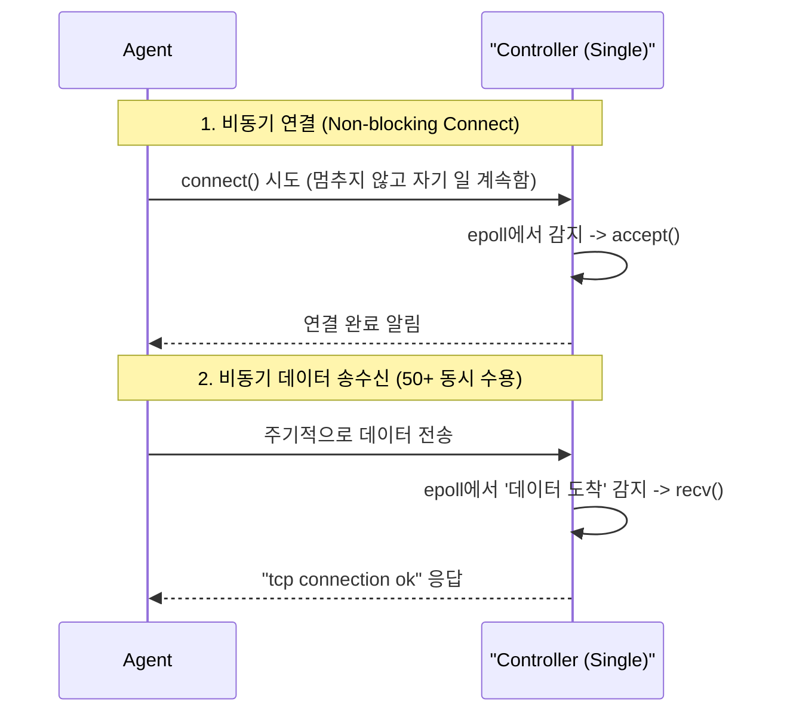
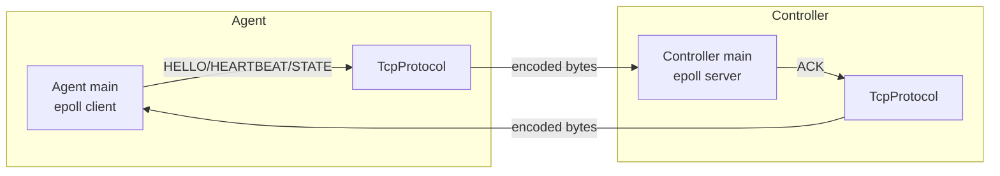
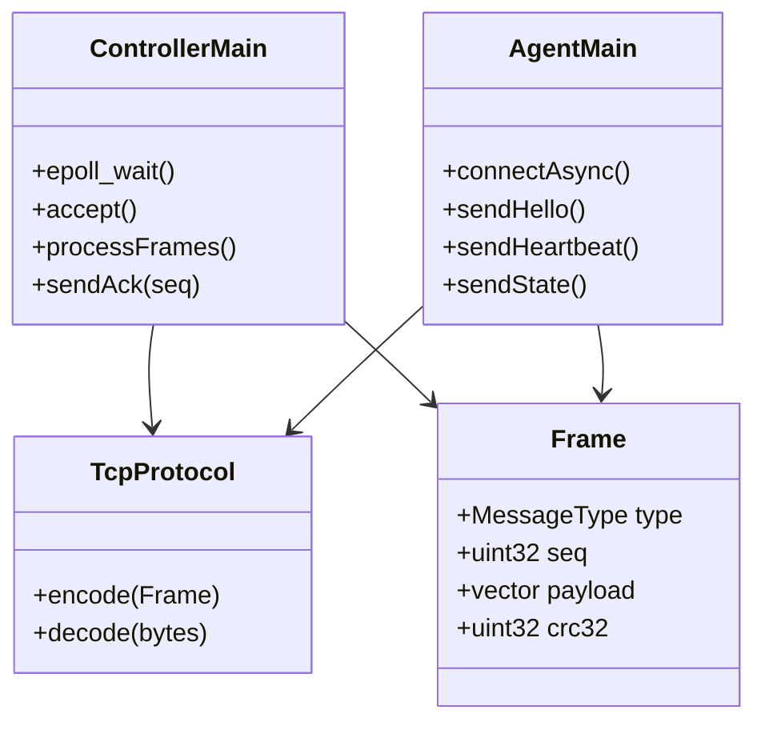

# DESIGN — 아키텍처 및 설계

요구사항(`요구사항.pdf`)에서 “Controller는 비차단 I/O로 50대 이상의 Agent를 단일 프로세스로 관리한다”를 충족하도록 현 구조를 정리함.

---

## 1. 시스템 구성

```
[agent-1]──┐
[agent-2]──┼──TCP 9090 (Docker bridge: sv_network)──► [controller]
[agent-N]──┘
```

- **controller** (`src/controller/src/main.cpp`): 서버 소켓을 `epoll`에 등록하고 단일 이벤트 루프에서 Agent 연결을 수락·관리함. 컨테이너명 `sv-controller`임.
- **agent** (`src/agent/src/main.cpp`): 비차단 `connect` 후 500ms 주기로 데이터를 송신하는 시뮬레이터임. 컨테이너명 `sv-agent`임.
- **libs (`src/libs`)**: Controller/Agent가 공유하는 `sv_core`(MemoryPool, TcpProtocol 등)와 `sv_logger` 모듈임.

### Agent–Controller 비동기 상호작용 (1:N)



- **HELLO (Handshake)**: Agent가 기동 후 Controller에 자신을 알리는 첫 번째 메시지.
- **HEARTBEAT (1s)**: 1초마다 생존 신호를 보내 연결 유지를 확인하고 타임아웃을 방지.
- **STATE (3s)**: 3초마다 CPU, 온도 등 실제 장치 메트릭(Custom 구조체)을 담아 보고.
- **ACK**: Controller가 모든 메시지를 정상 수신했음을 동일한 시퀀스 번호(seq)로 응답.


- Controller는 `epoll_wait` 결과를 순회하며 새 연결과 Frame 도착을 구분함.
- Agent는 `EPOLLOUT` 이벤트로 연결 완료를 확인한 뒤 `EPOLLIN` 모드로 전환함.
- `test_epoll_scale.sh`는 이 왕복 루프를 Controller 1 vs Agent N 스케일까지 반복적으로 검증함.
- 정리: **epoll은 이벤트/데이터 수신을 알리는 용도**, **`TcpProtocol`은 해당 바이트를 SV 헤더/CRC 규칙대로 묶고 풀어주는 역할**을 담당함.

### 2. Custom Wire Protocol 상세 (Data Layout)



TCP는 데이터를 "바이트 덩어리(Stream)"로 취급하기 때문에, 수신 측에서 어디까지가 하나의 메시지인지, 어떤 타입(HELLO인지 STATE인지)인지 알 수 없다. 이를 해결하기 위해 다음과 같은 고정 헤더 포맷을 사용한다.

#### **2.1 Custom Wire Format (바이트 구조)**
`tcp_protocol.h`에 정의된 데이터 레이아웃입니다.
`[S][V][Version][Type][Seq 4B][Length 4B][Payload...]`

- **S, V (Magic)**: 이 시스템의 패킷임을 식별 (0x53, 0x56)
- **Type**: HELLO(0x01), HEARTBEAT(0x02), STATE(0x03) 등 구분
- **Seq**: 메시지 순서 번호 (응답 ACK와 매칭용)
- **Length**: 뒤에 오는 실제 데이터(JSON)의 길이

#### **2.2 핵심 함수 (One-liner)**
- **`encode()`**: `Frame`(타입, seq, JSON) → **바이트 배열**로 변환하여 `send()` 가능하게 만듦.
- **`decode()`**: `recv()`로 받은 **바이트 배열** → `Frame`(타입, seq, JSON)으로 복원.

---

## 3. 파일별 역할 (Responsibilities)

이 시스템을 구성하는 주요 파일들의 역할은 다음과 같다.

| 파일명 | 역할  | 
| :--- | :--- |
| **`protocol.h`** | "encode/decode 함수가 반드시 있어야 한다"는 **(인터페이스)** |
| **`tcp_protocol.h/cpp`** | 위 인터페이스를 실제로 구현하는 **구현체** (바이너리 패킷 조립 및 해체) |
| **`main.cpp (Agent)`** | 소켓 연결 후 1초/3초 주기로 **HELLO/HEARTBEAT/STATE 전송** |
| **`main.cpp (Controller)`** | 소켓 수신 후 **프레임 분석(decode) 및 ACK 응답** 전송 |
| **`memory_pool.h/cpp`** | 데이터 처리를 위한 메모리를 미리 확보하고 관리 (Phase 1 완료) |

### 클래스 다이어그램



---

## 2. 현재 동작 흐름 (코드 반영)

1. **Listen & Accept** (`src/controller/src/main.cpp`):
   - 서버 소켓을 `O_NONBLOCK` + `SO_REUSEADDR`로 설정함.
   - `epoll_ctl`로 `EPOLLIN` 등록 후 `epoll_wait` 루프를 돌림.
   - 새 연결 발생 시 `accept` 후 클라이언트 FD를 `EPOLLIN | EPOLLET`으로 등록함.

2. **Agent Connect & Frame 전송** (`src/agent/src/main.cpp`):
   - 비차단 소켓과 DNS 재시도를 수행함.
   - `EPOLLOUT` 이벤트로 연결 성공을 확인한 뒤 `EPOLLIN` 모드로 전환함.
   - HELLO 1회, HEARTBEAT(1s)·STATE(3s) 프레임을 전송하고 seq/CRC 를 자동 증가시킴.

3. **Controller Frame 처리**:
   - Controller는 누적 버퍼에 데이터를 쌓고 `TcpProtocol::decode` 로 Frame을 추출함.
   - HELLO/HEARTBEAT/STATE 를 수신하면 동일 seq 로 ACK 프레임을 전송함.
   - CRC 불일치나 잘못된 헤더는 바로 폐기함.

4. **스케일 테스트**:
   - `test_epoll_scale.sh`가 컨테이너를 빌드/기동하고 Agent 수를 스케일아웃함.
   - Ctrl+C 입력 시 `docker compose down`으로 정리함.

이 흐름이 현재 “1차 버전”에서 실제로 검증된 동작임.

---

## 3. 향후 확장 단계 (TODO)

| 단계 | 내용 | 구현 대상 |
|------|------|-----------|
| 1 | (완료) Custom Wire Protocol 통합, HELLO/HEARTBEAT/STATE/ACK 교환 | controller/agent main |
| 2 | Controller에서 STATE 수신 → AgentStateStore dispatch | Controller 로직, `IStateStore` 구현 |
| 3 | ThresholdPolicyEngine + ICommandBus로 명령 발행 | 신규 `policy_engine`/`command_bus` |
| 4 | Config 파일 mtime 감시 및 `loadConfig()` 핫 리로드 | Controller/Agent 설정 감시기 |
| 5 | 구조화 로그/메트릭, 재시도/백오프, CMD_* 명령 플로우 | 공통 |

각 단계가 완료되면 본 문서의 해당 섹션을 실제 구현 내용으로 갱신함.

### 클래스 책임 요약
| 구성요소 | 역할 |
|----------|------|
| `Controller main` | epoll 서버 루프, FD별 누적 버퍼 관리, `TcpProtocol::decode()` 호출, HELLO/HEARTBEAT/STATE 처리 후 ACK 전송 |
| `Agent main` | DNS/비동기 connect, HELLO·HEARTBEAT·STATE 생성, ACK 수신 로그 기록 |
| `sv::TcpProtocol` | Hesai PTC 기반 헤더 인코딩, CRC32 계산/검증, 부분 수신 처리 |
| `Frame` 구조체 | MessageType/seq/payload/crc32 필드를 보유해 양쪽 공통 데이터 모델 제공 |
