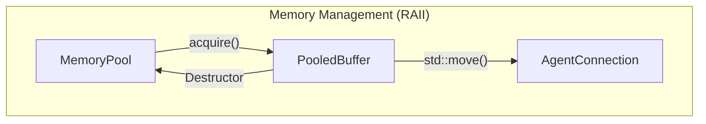

# DESIGN — 아키텍처 및 설계

## 1. 시스템 구성 [DONE && Todo]

```
[agent-1]──┐
[agent-2]──┼──TCP 9090 (sv_network)──► [controller]──:9091 Prometheus metrics
[agent-3]──┘
```

- **controller**: Agent 상태 수집, 헬스체크, 정책 평가, 명령 발행 (Docker 서비스명: `controller`)
- **agent**: 장치 시뮬레이터. 센서값(CPU/온도/부하) 생성, 명령 수신·실행 (Docker 서비스명: `agent`)
- **libs** (`sv_assignment_core_module`): 두 이미지가 공유하는 공용 라이브러리

## 2. Wire Protocol

Length-Prefixed Binary + JSON payload.

```
[magic 2B][version 1B][type 1B][seq uint32 LE][payload_len uint32 LE][payload JSON]
  0x53 0x56   0x01
```

| type | 값 | 방향 |
|------|----|------|
| HELLO | 0x01 | Agent → Controller |
| HEARTBEAT | 0x02 | Agent → Controller |
| STATE | 0x03 | Agent → Controller |
| CMD_START | 0x04 | Controller → Agent |
| CMD_STOP | 0x05 | Controller → Agent |
| CMD_SET_MODE | 0x06 | Controller → Agent |
| CMD_UPDATE_CONFIG | 0x07 | Controller → Agent |
| ACK | 0x08 | 양방향 |
| NACK | 0x09 | 양방향 |
| ERROR | 0x0A | 양방향 |

## 3. 핵심 인터페이스

공통 인터페이스는 `src/libs/core/include/core/` 에 정의한다.

```cpp
// Frame — 통신 단위
struct Frame {
    MessageType          type;
    uint32_t             seq{0};
    std::vector<uint8_t> payload; // JSON bytes
};

// IProtocol — 직렬화/역직렬화
class IProtocol {
public:
    virtual std::vector<uint8_t> encode(const Frame&) const = 0;
    virtual std::unique_ptr<Frame> decode(const uint8_t* data, size_t len,
                                          size_t& consumed) = 0;
};

// IAgentConnection — TCP 연결 추상화
class IAgentConnection {
public:
    virtual bool send(Frame frame) = 0;
    virtual bool is_alive() const = 0;
    virtual int64_t last_heartbeat_ms() const = 0;
    virtual void set_receive_callback(std::function<void(Frame)> cb) = 0;
};

// ICommandBus — 명령 발행 단일 입구 (재시도·백오프 내장)
class ICommandBus {
public:
    virtual void dispatch(const std::string& agent_id, Frame cmd) = 0;
    virtual std::vector<std::string> broadcast(Frame cmd,
                                               const std::string& group = "") = 0;
};

// IStateStore<T> — 상태 중앙 관리 (C# INotifyPropertyChanged)
// dispatch → reduce → notify_all(old, new)
template<typename TState>
class IStateStore {
public:
    virtual void dispatch(const std::string& event_type,
                          const nlohmann::json& payload) = 0;
    virtual TState get_state() const = 0;
    virtual void subscribe(std::function<void(const TState&, const TState&)> cb) = 0;
};

// IPolicyEngine — 상태 변화 시 자동 평가
class IPolicyEngine {
public:
    virtual void evaluate(const ControllerState& old_s,
                          const ControllerState& new_s) = 0;
    virtual void load_config(const nlohmann::json& cfg) = 0;
};
```

## 4. 주요 자료형

```cpp
struct AgentMetrics {
    double cpu_pct{0.0};
    double temperature{0.0};
    double load_avg{0.0};
};

struct AgentInfo {
    std::string  agent_id;
    std::string  group;
    std::string  mode{"Active"};
    AgentMetrics metrics;
    int64_t      last_heartbeat_ms{0};
    bool         alive{false};
};

struct ControllerState {
    std::map<std::string, AgentInfo> agents;
    int64_t updated_at_ms{0};
};
```

## 5. 소유권 모델 및 메모리 관리



### 5.1 데이터 버퍼 관리 (MemoryPool)

*   **가장 먼저 만든 이유**: 
    `요구사항.pdf`에서 "데이터 크기가 제각각인 페이로드(Payload)를 안전하게 관리하라"는 내용이 핵심이었기 때문입니다. 특히 고화질 카메라 영상처럼 큰 데이터를 다룰 때 시스템이 느려지는 것을 방지하기 위해, 미리 메모리를 확보해두는 **커스텀 메모리 풀**을 가장 먼저 설계하고 구현함.

*   **어떻게 작동하나? (설계 방향)**:
    *   **빌려 쓰기**: `MemoryPool::acquire()`를 통해 필요한 만큼 메모리를 소유권 이전 받음 (구현 예정).
    *   **주인 표시하기**: `std::move`를 사용하여 데이터를 넘겨줌으로써 "누가 데이터를 가지고 있는지" 코드에서 명확히 보이게 함 (구현 예정).

*   **앞으로 할 일**:
    *   메모리 풀의 실제 사용량(Hit/Miss)을 나중에 그래프로 확인할 수 있게 연결할 예정.
    *   통신 모듈이 완성되면 데이터가 버퍼를 타고 흐르는 과정을 그림으로 정리 예정.

### 5.2 안전하게 사용하기 (단계별 진행 중)

*   **구현 상태 요약**: 
    *   **[현재 구현됨]**: 메모리 풀 생성 시 메모리 블록 할당 및 전체 가용 개수 확인(`available()`) 기능.
    *   **[예정 - 2단계]**: 메모리 블록을 실제로 빌려오는 기능(`acquire()`).
    *   **[예정 - 3단계]**: 빌려온 버퍼를 다 쓰면 자동으로 반환하는 기능(`PooledBuffer` RAII).
    *   **[예정 - 4단계]**: 소유권 이전(`std::move`) 및 복사 방지 로직.
    *   **[예정 - 5단계]**: 외부 메모리 반환 차단 등 안전장치.


## 6. 주요 동작 흐름

### 6.0 기초 통신 확인 [DONE]
현재 구현된 가장 기본적인 통신 구조 / 연결을 먼저 시키고 모듈과 기능을 붙이는 작업 진행 예정.

1. **대기**: **Controller**가 9090 포트를 열고 연결을 기다림.
2. **노크**: **Agent**가 `controller:9090` 주소로 TCP 연결을 시도.
3. **인사**: 연결 성공 시 **Agent**가 `"hello from agent"` 메시지를 전송.
4. **응답**: **Controller**는 메시지 수신 후 `"tcp connection ok"`라고 Respone.
5. **확인**: 양측 로그에 성공 메시지가 기록되면 기초 통신 환경 구축이 완료된 것.

### 6.1 정상 흐름

```
Agent 기동 → HELLO 전송 → Controller 등록
Agent 1s마다 HEARTBEAT → Controller last_heartbeat 갱신
Agent 3s마다 STATE     → IStateStore::dispatch → IPolicyEngine::evaluate
PolicyEngine: load_avg > threshold → ICommandBus::broadcast(CMD_SET_MODE)
Agent CMD_SET_MODE 수신 → ACK 응답 → mode 변경
```

### 6.2 헬스체크 타임아웃

```
HealthMonitor 500ms 주기 폴링
now - last_heartbeat > 3000ms → agent.alive = false
→ IStateStore dispatch(agent_dead) → IPolicyEngine → CMD_STOP (보상)
```
```

## 7. 설정 핫-리로드

- Controller/Agent 모두 1s 주기로 config 파일 mtime 감지
- 변경 감지 시 mutex 보호하에 정책 임계값 교체 (재시작 없음)

## 8. 단위 테스트 계획

| 테스트 | 검증 내용 |
|--------|----------|
| test_protocol | Frame encode/decode, magic 검증, 부분 수신 |
| test_command_bus | dispatch ACK/NACK, retry backoff |
| test_policy_engine | 임계값 평가, config 로드 |
| test_state_store | dispatch→reduce→notify_all |
| test_message_pool | 풀 할당/해제, 히트율 |
| test_integration | Controller–Agent HELLO/HEARTBEAT/CMD 전체 흐름 |
