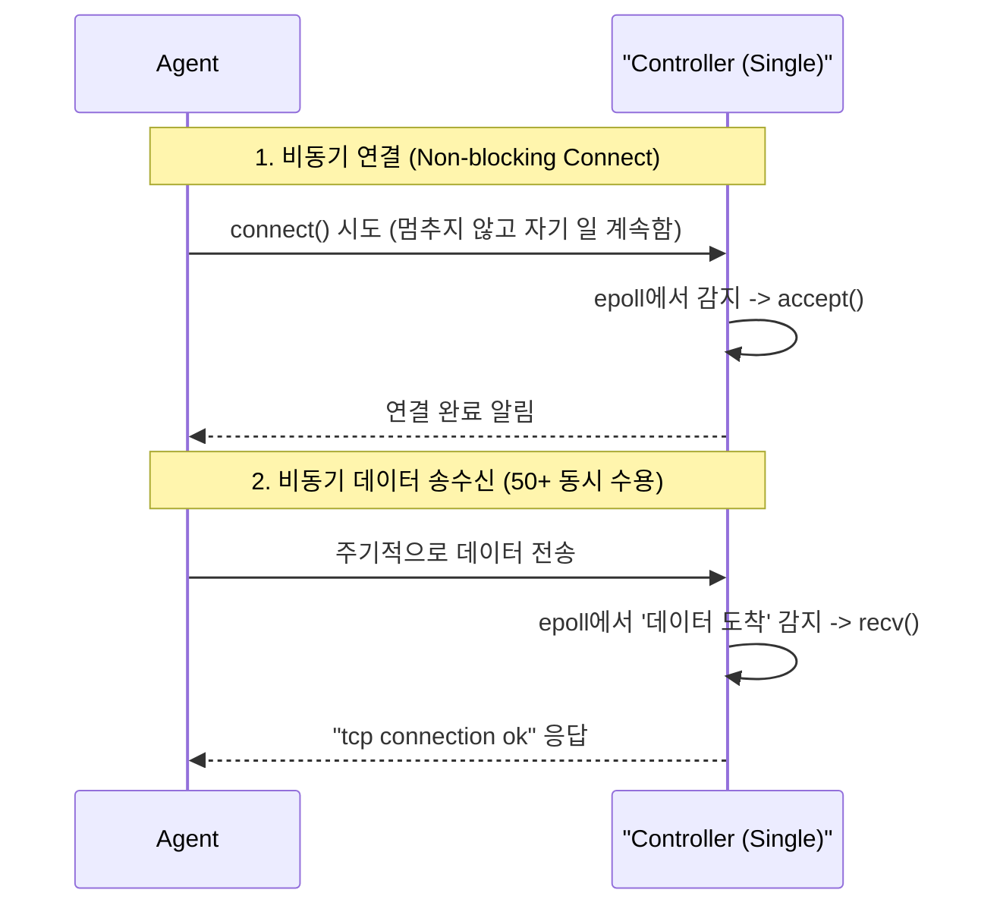

# DESIGN — 아키텍처 및 설계

요구사항(`요구사항.pdf`)에서 “Controller는 비차단 I/O로 50대 이상의 Agent를 단일 프로세스로 관리한다”를 충족하도록 현 구조를 정리함.

---

## 1. 시스템 구성

```
[agent-1]──┐
[agent-2]──┼──TCP 9090 (Docker bridge: sv_network)──► [controller]
[agent-N]──┘
```

- **controller** (`src/controller/src/main.cpp`): 서버 소켓을 `epoll`에 등록하고 단일 이벤트 루프에서 Agent 연결을 수락·관리함. 컨테이너명 `sv-controller`임.
- **agent** (`src/agent/src/main.cpp`): 비차단 `connect` 후 500ms 주기로 데이터를 송신하는 시뮬레이터임. 컨테이너명 `sv-agent`임.
- **libs (`src/libs`)**: Controller/Agent가 공유하는 `sv_core`(MemoryPool, TcpProtocol 등)와 `sv_logger` 모듈임.

### Agent–Controller 비동기 상호작용 (1:N)



- Controller는 `epoll_wait` 결과를 순회하며 새 연결과 데이터 도착을 구분함.
- Agent는 `EPOLLOUT` 이벤트로 연결 완료를 확인한 뒤 `EPOLLIN` 모드로 전환함.
- `test_epoll_scale.sh`는 이 왕복 루프를 Controller 1 vs Agent N 스케일까지 반복적으로 검증함.

---

## 2. 현재 동작 흐름 (코드 반영)

1. **Listen & Accept** (`src/controller/src/main.cpp`):
   - 서버 소켓을 `O_NONBLOCK` + `SO_REUSEADDR`로 설정함.
   - `epoll_ctl`로 `EPOLLIN` 등록 후 `epoll_wait` 루프를 돌림.
   - 새 연결 발생 시 `accept` 후 클라이언트 FD를 `EPOLLIN | EPOLLET`으로 등록함.

2. **Agent Connect & State Machine** (`src/agent/src/main.cpp`):
   - 비차단 소켓과 DNS 재시도를 수행함.
   - `EPOLLOUT` 이벤트로 연결 성공을 확인한 뒤 `EPOLLIN` 모드로 전환함.
   - 500ms 주기로 `"hello from agent"` 메시지를 송신함.

3. **Echo & Logging**:
   - Controller는 `recv` 결과를 stdout에 출력하고 `"tcp connection ok"` 문자열로 회신함.
   - 연결 종료 시 FD를 닫고 로그를 남김.

4. **스케일 테스트**:
   - `test_epoll_scale.sh`가 컨테이너를 빌드/기동하고 Agent 수를 스케일아웃함.
   - Ctrl+C 입력 시 `docker compose down`으로 정리함.

이 흐름이 현재 “1차 버전”에서 실제로 검증된 동작임.

---

## 3. 향후 확장 단계 (TODO)

| 단계 | 내용 | 구현 대상 |
|------|------|-----------|
| 1 | `sv::TcpProtocol`을 Controller/Agent main 루프에 통합 (Frame 단위 I/O) | `src/controller/src/main.cpp`, `src/agent/src/main.cpp` |
| 2 | Agent HEARTBEAT + STATE payload 전송 (cpu/temp/load_avg) | Agent 로직, `message.h` |
| 3 | Controller에서 STATE 수신 → AgentStateStore dispatch | Controller 로직, `IStateStore` 구현 |
| 4 | ThresholdPolicyEngine + ICommandBus로 명령 발행 | 신규 `policy_engine`/`command_bus` |
| 5 | Config 파일 mtime 감시 및 `loadConfig()` 핫 리로드 | Controller/Agent 설정 감시기 |

각 단계가 완료되면 본 문서의 해당 섹션을 실제 구현 내용으로 갱신함.
