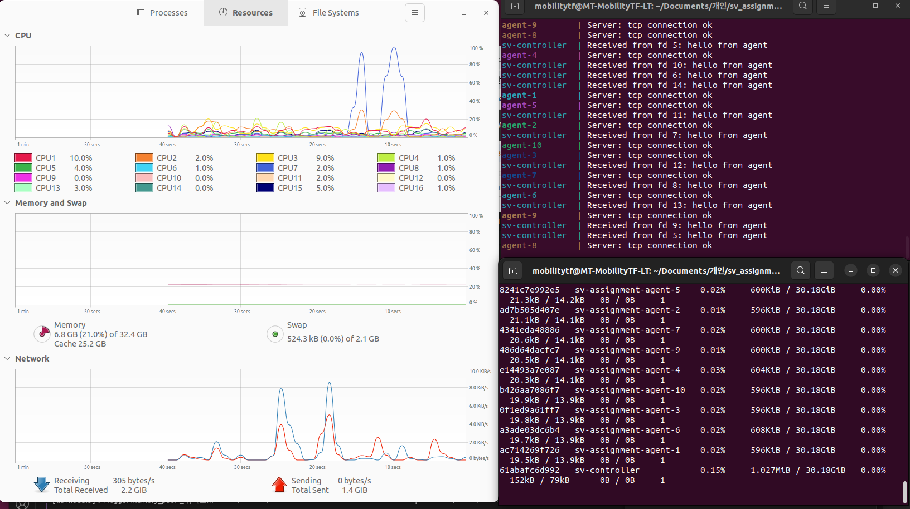
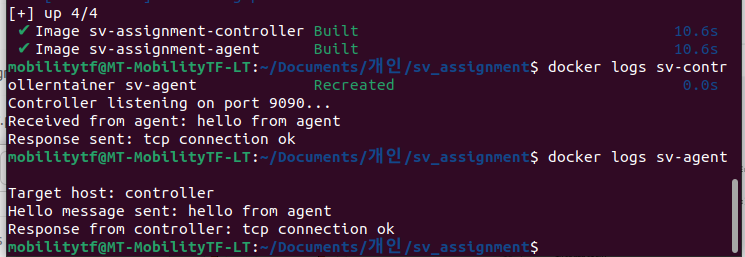
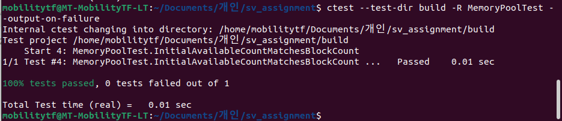

# PERF — 성능 측정

## 1. 성능 목표

| ID | 시나리오 | 목표 |
|----|----------|------|
| P1 | 명령 round-trip P50 | < 30 ms |
| P2 | 명령 round-trip P95 | < 100 ms |
| P3 | Agent 50대 연결 시 Controller CPU | < 5 % |
| P4 | Controller RSS | < 50 MB |

## 2. 측정 환경

- OS: Linux (Docker Engine)
- Controller: 1 인스턴스 (`sv-controller`, port 9090)
- Agent: 1 ~ 50 인스턴스 (`sv-agent`)
- 전송 주기: HEARTBEAT 1s, STATE 3s

## 3. 측정 절차

```bash
./test_epoll_scale.sh 50
sleep 30
docker stats sv-controller --no-stream --format "CPU={{.CPUPerc}} MEM={{.MemUsage}}"
```

## 4. 측정 기록

| 시나리오 | 연결 수 | Controller CPU (%) | Controller Mem (MB) | 비고 |
|----------|---------|--------------------|---------------------|------|
| 1v3 | 3 | | | 기본 통신 |
| 1v10 | 10 | | | |
| 1v50 | 50 | | | Steady state 기준 |




## 5. 빌드/테스트 이력

| 날짜 | 내용 |
|------|------|
| 2024-03-21 | `test_logger.cpp` 컴파일 오류 수정, Logger 단위 테스트 3/3 통과 |
| 2024-03-21 | MemoryPool 단위 테스트 1단계 통과 |
| 2024-03-22 | HELLO/HEARTBEAT/STATE/ACK 교환 및 CRC 검증 확인 (1v3) |
| 2026-03-23 | PolicyEngine 단위 테스트 3/3 통과, CMD_SET_MODE ACK 프로토콜 단위 테스트 3/3 통과 |
| 2026-03-23 | Docker 7-agent 실 구동 검증: avgLoad=74.73 → safe 모드 전환 확인 |

## 6. 단위 테스트 결과

| 모듈 | 항목 | 케이스 수 | 결과 |
|------|------|-----------|------|
| Logger | 싱글턴, 레벨 필터링, 매크로 안정성 | 3 | PASS |
| PolicyEngine | safe 임계치 초과, 동일 모드 재진입, dead zone 유지, 모드 전환 | 4 | - |
| CMD_SET_MODE ACK | encode/decode 왕복, ACK seq 보존 | 3 | PASS |




## 7. PolicyEngine 실 구동 측정 (2026-03-23)

Docker 1 Controller + 7 Agent (camera×3, lidar×1, imu×1, sync_board×1, pc×1) 환경에서 관찰된 값:

| 항목 | 값 |
|------|-----|
| 관측 avgLoad (camera 그룹) | 74.73 |
| 정책 결정 결과 | safe |
| CMD_SET_MODE 전송 → ACK 수신 | 확인 |
| epoll_wait 주기 | 1000 ms |

## 8. TODO

- Round-trip latency 자동 계측 스크립트
- 핫-리로드 (policy.json 변경) 후 CPU 영향 재측정
