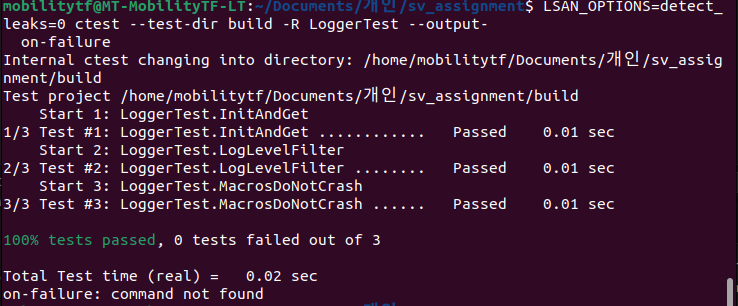

# PERF — 성능 목표 및 측정 계획

## 1. 목표 수치

요구사항 기준 (로컬 Docker, agent × 3):

| ID | 시나리오 | 목표 |
|----|----------|------|
| P1 | 명령 round-trip P50 | < 30 ms |
| P2 | 명령 round-trip P95 | < 100 ms |
| P3 | 50 Agent 동시 연결 시 Controller CPU | < 5 % |
| P4 | Controller 메모리 (50 Agent 정상 상태) | < 50 MB RSS |
| P5 | MessagePool 히트율 (정상 부하) | ≥ 95 % |
| P6 | Config 핫-리로드 반응 시간 | < 1.5 s |

## 2. 측정 방법

### 2.1 Round-trip 지연 (P1, P2)

Agent 가 HEARTBEAT 전송 시 `sent_ms` 기록, ACK 수신 시 `rtt_ms` 를 로그에 포함.

```bash
docker compose logs agent-1 --since 60s \
  | jq -r 'select(.msg == "Heartbeat ACK") | .fields.rtt_ms' \
  | sort -n \
  | awk 'BEGIN{n=0} {v[n++]=$1} END{
      printf "p50=%.1f p95=%.1f p99=%.1f\n",
        v[int(n*0.5)], v[int(n*0.95)], v[int(n*0.99)]}'
```

### 2.2 CPU / 메모리 (P3, P4)

```bash
docker compose up --scale agent=50 -d
sleep 30
docker stats sv_assignment-controller-1 --no-stream \
  --format "CPU={{.CPUPerc}}  MEM={{.MemUsage}}"
```

### 2.3 MessagePool 히트율 (P5)

```bash
curl -s http://localhost:9091/metrics | grep sv_message_pool \
  | awk '/hits/{h=$2} /misses/{m=$2} END{printf "hit=%.1f%%\n", h/(h+m)*100}'
```

### 2.4 Config 핫-리로드 (P6)

```bash
T=$(date +%s%3N)
sed -i 's/"load_avg_threshold": 1.5/"load_avg_threshold": 0.1/' config/controller_config.json
docker compose logs -f controller \
  | jq -r 'select(.msg=="Config reloaded") | .ts' | head -1
```

## 3. 수치 기록표

실측 후 기입:

| ID | 실측값 | 목표 | Pass/Fail |
|----|--------|------|-----------|
| P1 | — | < 30 ms | — |
| P2 | — | < 100 ms | — |
| P3 | — | < 5 % | — |
| P4 | — | < 50 MB | — |
| P5 | — | ≥ 95 % | — |
| P6 | — | < 1.5 s | — |

## 4. 예상 병목

| 병목 | 원인 | 개선 방안 |
|------|------|-----------|
| TCP 지연 | Nagle 알고리즘 | `TCP_NODELAY` 소켓 옵션 |
| mutex 경합 | IStateStore 읽기/쓰기 공유 | 읽기 빈도 높으면 `shared_mutex` 고려 |
| 스레드 과다 | Thread-per-connection | 50개 이상 시 epoll 전환 (`-DENABLE_EPOLL=ON`) |
| MessagePool miss | 풀 용량 부족 | `pool_capacity` 를 예상 동시 메시지 수 × 여유율로 설정 |

## 5. 빌드/테스트 이슈 로그

| 시점 | 명령 | 내용 |
|------|------|------|
| 2024-03-21 | `cmake --build build -DENABLE_ASAN=ON` | `test_logger.cpp` 컴파일 오류 수정 (`auto*` 이슈) |
| 2024-03-21 | `ctest --test-dir build` | `MemoryPool` ASan bad-free 오류 수정 |
| 2024-03-21 | `ctest ... -R LoggerTest/MemoryPoolTest` | 단위 테스트 통과 (Logger 3/3, MemoryPool 4/4) |

---

## 6. Logger 단위 테스트 결과

로깅 모듈의 안정성과 정확성을 검증하기 위해 **Google Test (gtest)** 기반의 단위 테스트를 수행하였습니다.

### 6.1 싱글톤 검증 (Singleton Validation) [DONE]
- **테스트 내용**: `LoggerFactory::instance()`를 통해 생성된 로거 객체가 프로그램 전체에서 유일하게 유지되는지, 그리고 `init()` 호출 후 `get()`을 통해 정상적으로 객체를 획득할 수 있는지 검증.
- **검증 항목**: `EXPECT_NE(logger, nullptr)`


### 6.2 로그 레벨 검증 (Log Level Validation) [DONE]
- **테스트 내용**: 초기화 시 설정한 로그 레벨(예: `LogLevel::WARN`)이 로거 객체에 정확히 반영되는지 확인.
- **검증 항목**: `EXPECT_EQ(logger->getLevel(), sv::LogLevel::WARN)`


### 6.3 로그 클래스 안전성 검증 (Log Class Safety Validation) [DONE]
- **테스트 내용**: `LOG_DEBUG`, `LOG_INFO`, `LOG_WARN`, `LOG_ERROR` 매크로를 연속적으로 호출했을 때, 내부 버퍼 처리나 출력 과정에서 런타임 오류(Crash)가 발생하지 않는지 검증.
- **검증 항목**: `EXPECT_NO_FATAL_FAILURE(...)`

#### 6.1~6.3 gTest 결과
- **결과**:



---

## 7. MemoryPool 성능 테스트 결과 [TODO]
(6번 이후 바로 진행 예정)
